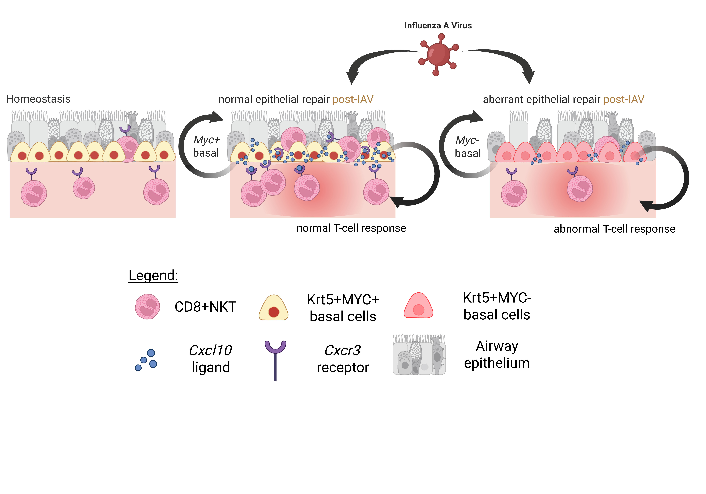
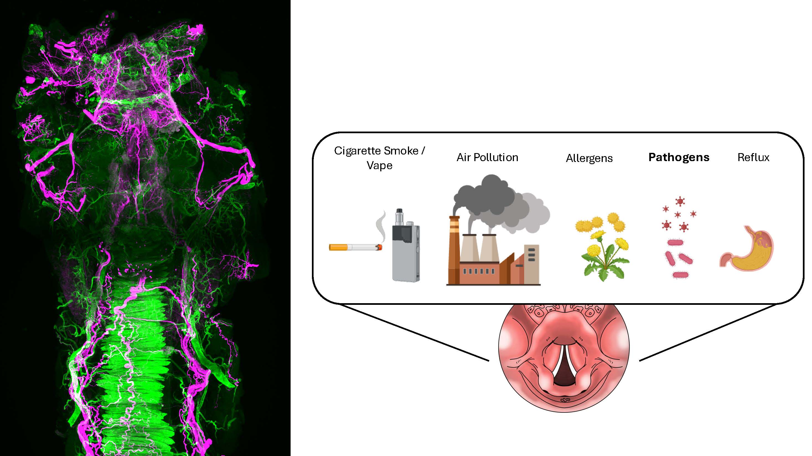
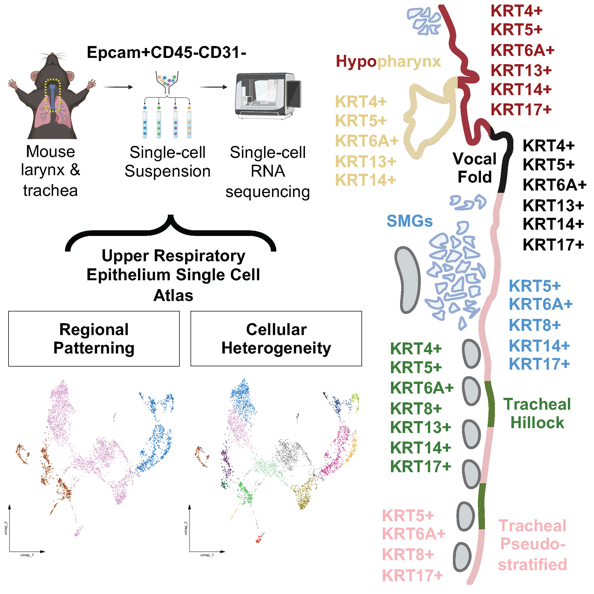
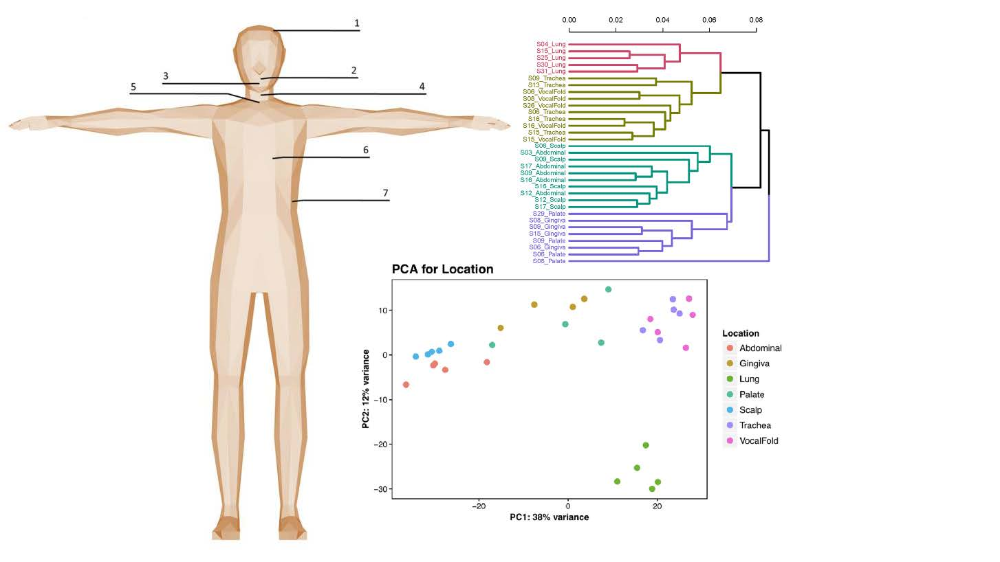
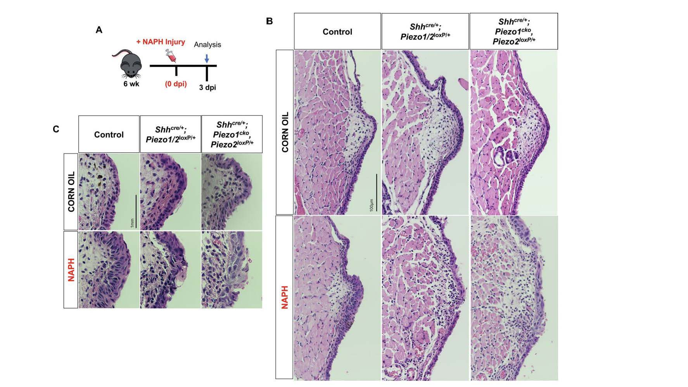
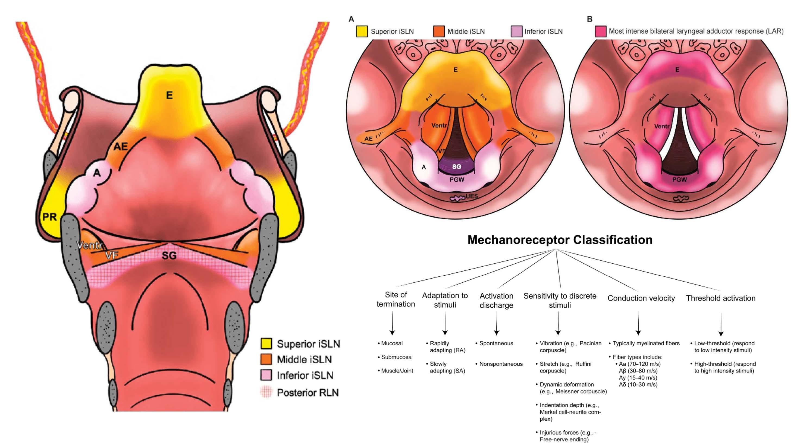

# Projects & Publications
### A non-canonical role of Myc in programming basal cells as sentinels of upper airway immunity during influenza infection
[PrePrint](https://www.biorxiv.org/content/10.64898/2025.12.22.696065v1.full)

HIGHLIGHTS:
- Influenza infection induces Myc upregulation specifically in upper airway sentinel basal progenitors 
- Myc drives basal cell secretion of CXCL10 to recruit cytotoxic CD8⁺ NKT effectors
- MYC-dependent CXCL10–CXCR3 axis establishes persistent upper airway antiviral immunity

### Neuroimmune interactions for laryngeal sensorimotor neuropathy in postviral influenza infection
[Funding Award](https://reporter.nih.gov/search/NzhijxcIoE-2-uPq0CEwkQ/project-details/10922743)

My current research is guided by the hypothesis that viral infection of the larynx activates neurosensory cells, remodels both afferent and efferent nerves, and contributes to mucosal inflammation and hypersensitivity. To test this hypothesis, **I am utilizing a combination of mouse genetics, whole tissue clearing and imaging, and single-cell transcriptomics.** Findings from this study will reveal the neuroimmune mechanism that mediate postviral laryngeal inflammation and sensorimotor neuropathies.

### Cellular heterogeneity and patterning strategies as revealed by upper respiratory epithelium single cell atlas
[Publication](https://www.cell.com/iscience/fulltext/S2589-0042(25)01106-X?_returnURL=https%3A%2F%2Flinkinghub.elsevier.com%2Fretrieve%2Fpii%2FS258900422501106X%3Fshowall%3Dtrue)

Mucosal surfaces lined by epithelial cells are essential elements of the respiratory tract, effective not only as a first-line physical barrier against chronic external threats, but also for host immune defense, and injury repair. Here, using **single cell RNAseq** combined with spatial validation, we present a comprehensive atlas of the mouse upper respiratory epithelium. This work serves as a valuable atlas for hypothesis-driven work into responses to environmental insults, genetic mutations, and infectious diseases.

### Tissue specific human fibroblast differential expression based on RNAsequencing analysis
[Publication](https://link.springer.com/article/10.1186/s12864-019-5682-5)

Physical forces, such as mechanical stress, are essential for tissue homeostasis and influence gene expression of cells. In particular, the fibroblast has demonstrated sensitivity to extracellular matrices with assumed adaptation upon various mechanical loads. The purpose of this study was to compare the vocal fold fibroblast genotype, known for its unique mechanically stressful tissue environment, with cellular counterparts at various other anatomic locales to identify differences in functional gene expression profiles. By using **bulk RNA-seq** technology, we identified differentially expressed gene programs (DEseq2) among seven normal human fibroblast primary cell lines from healthy cadavers, which included: vocal fold, trachea, lung, abdomen, scalp, upper gingiva, and soft palate.

### _Piezo1_-expressing vocal fold epithelia modulate remodeling via effects on self-renewal and cytokeratin differentiation
[Publication](https://link.springer.com/article/10.1007/s00018-022-04622-6)

Mechanoreceptors are implicated as functional afferents within mucosa of the airways and the recent discovery of mechanosensitive channels _Piezo1_ and _Piezo2_ has proved essential for cells of various mechanically sensitive tissues. However, the role for _Piezo1/2 _ in vocal fold (VF) mucosal epithelia, a cell that withstands excessive biomechanical insult, remains unknown. The purpose of this study was to test the hypothesis that _Piezo1_ is required for VF mucosal repair pathways of epithelial cell injury. Utilizing cell-based assays within genetically-engineered murine tissue, we demonstrated a role for _Piezo1_-expressing VF epithelia in regulating self-renewal via effects on _p63_ transcription and YAP subcellular translocation—altering cytokeratin differentiation.

### Sensory innervation of the larynx and the search for mucosal mechanoreceptors
[Publication](https://pubs.asha.org/doi/abs/10.1044/2020_JSLHR-20-00350)

This review article improved understanding of iSLN innervation and corresponding mechanotransduction events to help shed light upon a variety of pathological reflex responses, including persistent cough, dysphonia, and laryngospasm.

[Full Publication Record](https://scholar.google.com/citations?user=HBHi-44AAAAJ&hl=en)
