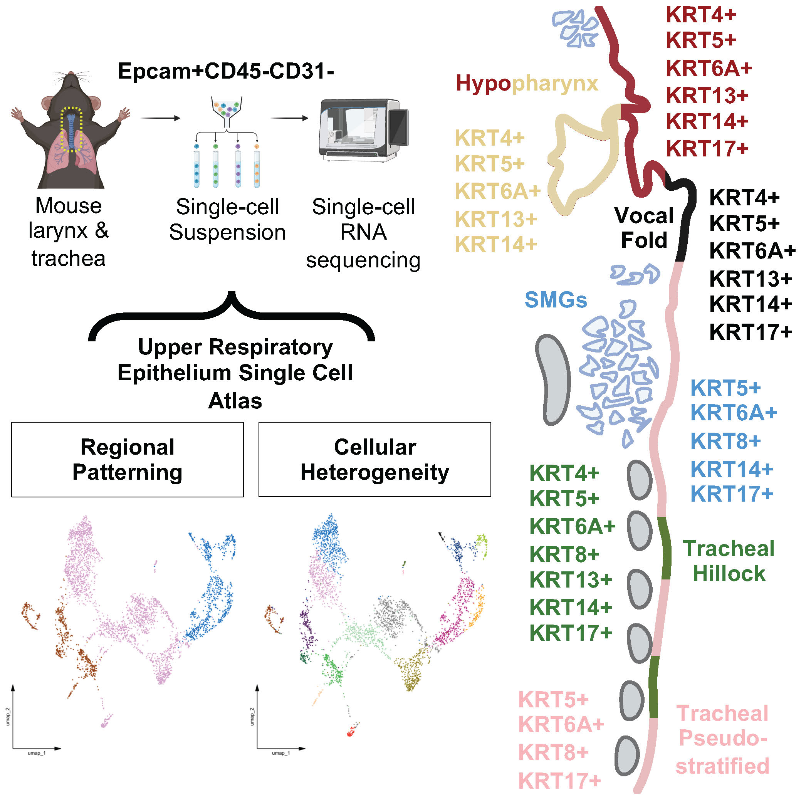

# Clinician-Scientist

## Education
<table>
  <tr>
    <th style="text-align:left;">Degree</th>
    <th style="text-align:center;">Field of Study</th>
    <th style="text-align:right;">Years</th>
  </tr>
  <tr>
    <td>Ph.D.</td>
    <td style="text-align:center;">CSD & Biomedical Engineering</td>
    <td style="text-align:right;"><em>2017-2022</em></td>
  </tr>
  <tr>
    <td>Fellowship</td>
    <td style="text-align:center;">Medical Voice Pathology</td>
    <td style="text-align:right;"><em>2015-2017</em></td>
  </tr>
  <tr>
    <td>M.A.</td>
    <td style="text-align:center;">Speech-Language Pathology</td>
    <td style="text-align:right;"><em>2012-2015</em></td>
  </tr>
  <tr>
    <td>B.A.</td>
    <td style="text-align:center;">Business Mgmt & Administration</td>
    <td style="text-align:right;"><em>2004-2008</em></td>
  </tr>
</table>

## Work Experience
**NIH F32 Postdoctoral Research Fellow @ UC-San Diego (_08/2022-present_)**
- Leveraged single-cell genomic and bioinformatic approaches to generate high-resolution cellular and molecular profiles of airway tissue using scRNA-seq (10X Genomics), uncovering the mechanistic role of oncogene _c-Myc_ during acute inflammation and chronic remodeling in an influenza mouse model, and identifying novel therapeutic targets for virus-induced pulmonary disease.

**LLM Designer | Biology Division @ OpenAI (_2024-present_)**
- Utilized my domain expertise to create high-quality human-derived training datasets (Project: Lion, Elephant) of tasks that were used to evaluate OpenAI LLMs for _Deep Research_ application.

**Clinical Adjunct Faculty (_2021-2024_)**
- Led graduate-level course (CD667-Voice Disorders), delivering virtual instruction, fostering critical discussions on evidence-based clinical practice, mentoring students, and assessing clinical reasoning through assignments, projects, and exams.

**NIH F31 Predoctoral Research Fellow @ UW-Madison (_2017-2022_)**
- Demonstrated therapeutic role of mechanosensitive ion channel proteins, _Piezo1/Piezo2_, in airway epithelial repair and regeneration.

**Research Associate @ UW-Madison (_2015-2017_)**
- Led multi-disciplinary collaboration across pathology, autopsy, clinical, and data science teams, facilitating the successful procurement and bioinformatic analysis of 33 tissue samples to generate a high-resolution transcriptomic dataset for novel biomarker discovery in fibroblast populations.

**Medical Speech Pathologist @ UW Hospital & Clinics (_2015-2017_)**
- Specialized in the assessment and treatment of voice/swallow disorders, upper airway dysfunction, and neurological, structural, and oncology-related conditions. Collaborated with physicians, medical providers, and clinical staff to ensure comprehensive, patient-centered care across diverse pediatric and geriatric populations.

**Clinical Graduate Research Trainee @ SUNY Buffalo (_2013-2015_)**
- Led a clinical study examining lifestyle health profiles, self-perceptions of voice, and acoustical correlates in contemporary professional voice users. Recruited and enrolled 15 study participants, leveraging patient population dynamics under PI supervision. Developed key study components, including literature review, project objectives, study design, protocols, informed consents, IRB/regulatory submissions, and timelines, ensuring compliance and successful execution.

## Projects & Publications
### Neuroimmune interactions for laryngeal sensorimotor neuropathy in postviral influenza infection
[Funding Award](https://reporter.nih.gov/search/NzhijxcIoE-2-uPq0CEwkQ/project-details/10922743)

My current research is guided by the hypothesis that viral infection of the larynx activates neurosensory cells, remodels both afferent and efferent nerves, and contributes to mucosal inflammation and hypersensitivity. To test this hypothesis, **I am utilizing a combination of mouse genetics, whole tissue clearing and imaging, and single-cell transcriptomics.** Findings from this study will reveal the neuroimmune mechanism that mediate postviral laryngeal inflammation and sensorimotor neuropathies.

### Cellular heterogeneity and patterning strategies as revealed by upper respiratory epithelium single cell atlas
[Publication](https://www.cell.com/iscience/fulltext/S2589-0042(25)01106-X?_returnURL=https%3A%2F%2Flinkinghub.elsevier.com%2Fretrieve%2Fpii%2FS258900422501106X%3Fshowall%3Dtrue)

Mucosal surfaces lined by epithelial cells are essential elements of the respiratory tract, effective not only as a first-line physical barrier against chronic external threats, but also for host immune defense, and injury repair. Here, using **single cell RNAseq** combined with spatial validation, we present a comprehensive atlas of the mouse upper respiratory epithelium. This work serves as a valuable atlas for hypothesis-driven work into responses to environmental insults, genetic mutations, and infectious diseases.

### Tissue specific human fibroblast differential expression based on RNAsequencing analysis
[Publication](https://link.springer.com/article/10.1186/s12864-019-5682-5)

Physical forces, such as mechanical stress, are essential for tissue homeostasis and influence gene expression of cells. In particular, the fibroblast has demonstrated sensitivity to extracellular matrices with assumed adaptation upon various mechanical loads. The purpose of this study was to compare the vocal fold fibroblast genotype, known for its unique mechanically stressful tissue environment, with cellular counterparts at various other anatomic locales to identify differences in functional gene expression profiles. By using **bulk RNA-seq** technology, we identified differentially expressed gene programs (DEseq2) among seven normal human fibroblast primary cell lines from healthy cadavers, which included: vocal fold, trachea, lung, abdomen, scalp, upper gingiva, and soft palate.

### _Piezo1_-expressing vocal fold epithelia modulate remodeling via effects on self-renewal and cytokeratin differentiation
[Publication](https://link.springer.com/article/10.1007/s00018-022-04622-6)

Mechanoreceptors are implicated as functional afferents within mucosa of the airways and the recent discovery of mechanosensitive channels _Piezo1_ and _Piezo2_ has proved essential for cells of various mechanically sensitive tissues. However, the role for _Piezo1/2 _ in vocal fold (VF) mucosal epithelia, a cell that withstands excessive biomechanical insult, remains unknown. The purpose of this study was to test the hypothesis that _Piezo1_ is required for VF mucosal repair pathways of epithelial cell injury. Utilizing cell-based assays within genetically-engineered murine tissue, we demonstrated a role for _Piezo1_-expressing VF epithelia in regulating self-renewal via effects on _p63_ transcription and YAP subcellular translocation—altering cytokeratin differentiation.

### Sensory innervation of the larynx and the search for mucosal mechanoreceptors
[Publication](https://pubs.asha.org/doi/abs/10.1044/2020_JSLHR-20-00350)

This review article improved understanding of iSLN innervation and corresponding mechanotransduction events to help shed light upon a variety of pathological reflex responses, including persistent cough, dysphonia, and laryngospasm.

[Full Publication Record](https://scholar.google.com/citations?user=HBHi-44AAAAJ&hl=en)
